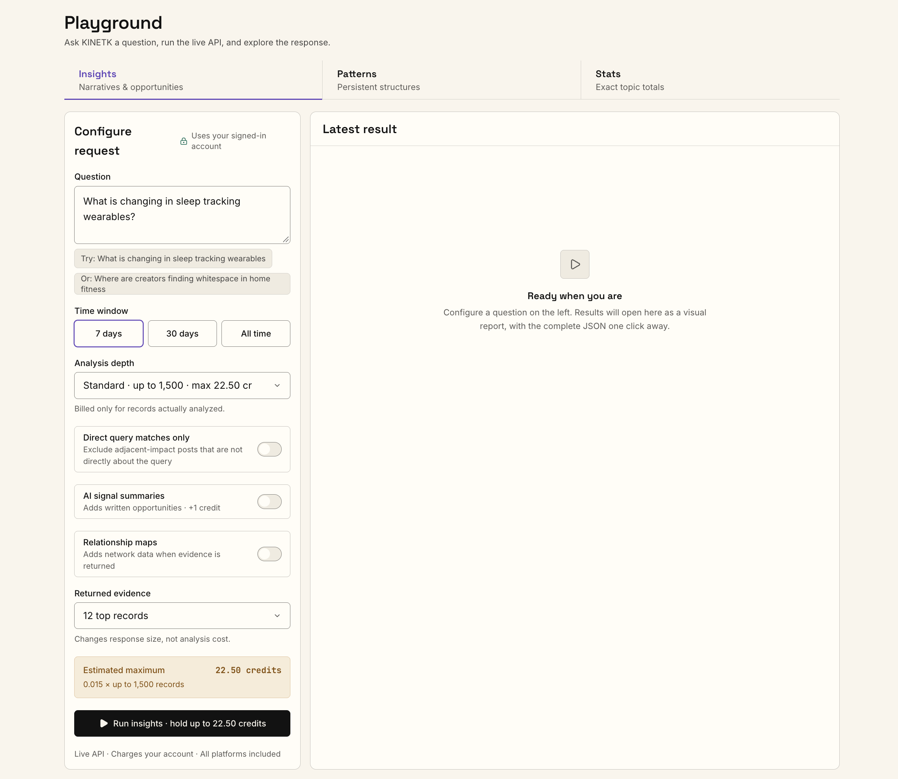

The fastest way to see what KINETK returns is the Playground. You don't write any code there, and every query in these docs can be run from it.

## 1. Get an API key

Sign in to the [KINETK platform](https://platform.kinetk.ai), open **API keys**, and create one. Keys look like `ktk_live_…`. The secret is shown **once**, when you create it, so store it right away. You can't retrieve it later, only revoke it and issue a new one.

Paid calls use credits (1 credit = $1.00 USD), which you buy on the platform's [billing page](https://platform.kinetk.ai/billing). The narrative and pattern reads are free. See [Pricing & Credits](./pricing.mdx).

## 2. Head to the Playground

Open the [Playground](https://platform.kinetk.ai/playground). Ask a question in plain English, pick a time window and analysis depth, and run it against the live API. The result opens as a visual report, and the complete JSON is one click away.



Each Playground tab runs one of the [analysis jobs](../guides/intelligence-jobs.mdx):

| Tab | What it answers | API equivalent |
|---|---|---|
| **Insights** | Narratives and opportunities around a question | `POST /intelligence/jobs` with `kind: "insights"` |
| **Patterns** | Persistent structures in the conversation | `kind: "patterns"` |
| **Stats** | Exact totals for a topic | `kind: "stats"` |

The Playground uses your signed-in account, so you don't paste a key. Runs are charged to your account like any API call. Before you run, it shows the estimated maximum credits, and you're billed only for the records actually analyzed. Use it to find the right question, window and depth, then copy those settings into your code.

## 3. Call the API from your code

<Card title="Try it in the API Reference" icon="play" href="/api-reference">
  Every endpoint has a **Try it** button. Paste your key and send real requests from your browser, no setup needed.
</Card>

When you're ready to integrate, export your base URL and key. Every example in these docs uses them:

```bash
export API_BASE="https://api.kinetk.ai/graph"
export API_KEY="<paste your key here>"
```

### Check the service

```bash
curl -H "x-api-key: $API_KEY" "$API_BASE/health"
```

A `200` with `"status": "ok"` means the service is up and its data is fresh. `sync.minutesSinceLastRun` shows how recently new content was ingested. See [Sync & Freshness](../guides/sync-and-freshness.mdx).

### Search

`POST /search` returns ranked content for a query in one synchronous call, along with the narratives and creators that content belongs to:

```bash
curl -X POST "$API_BASE/search" \
  -H "x-api-key: $API_KEY" -H "content-type: application/json" \
  -d '{ "query": "sneaker drops", "window": "7d", "limit": 20 }'
```

```jsonc
{
  "query": "sneaker drops",
  "window": "7d",
  "content": [ { "uuid": "…", "platform": "TIKTOK", "title": "…", "narrativeIds": ["4182"] } ],
  "narratives": [ { "id": "4182", "label": "Limited sneaker drop hype", "source": "tracked" } ],
  "patterns": [],
  "creators": [ { "creatorId": 1234, "platform": "TIKTOK", "hits": 3, "followerCount": 120000 } ],
  "usage": { "credits": 0.2 }
}
```

This call costs 0.01 credits per record returned, so **20 records cost 0.2 credits.** See [Search](../guides/search.mdx).

### Drill into a narrative (free)

Take a narrative `id` from the search and read its full evidence:

```bash
curl -H "x-api-key: $API_KEY" "$API_BASE/narratives/4182"
```

You get its member posts, top creators and per-platform breakdown. To browse what's trending without a query:

```bash
curl -H "x-api-key: $API_KEY" "$API_BASE/narratives/trending?window=7d&limit=10"
```

The precomputed narrative and pattern reads are free. See [Narrative Intelligence](../guides/narrative-intelligence.mdx).

### Run a full analysis (async)

This is the same analysis as the Playground's **Insights** tab: narratives with corpus trajectory and sentiment, tag and theme signals, and platform opportunities. Submit an `insights` job:

```bash
curl -X POST "$API_BASE/intelligence/jobs" \
  -H "x-api-key: $API_KEY" -H "content-type: application/json" \
  -d '{
    "kind": "insights",
    "input": { "query": "sneaker drops", "window": "7d", "limit": 500 }
  }'
```

`limit` sets how many records to analyze. At 0.015 credits per record, this job costs at most **7.5 credits**. If you omit it, you get the default depth (1,500 records on `7d`). The submit returns immediately:

```json
{ "jobId": "0190bd6f-…", "status": "queued", "estimated_cost": 7.5, "statusUrl": "/intelligence/jobs/0190bd6f-…" }
```

Poll until it succeeds:

```bash
curl -H "x-api-key: $API_KEY" "$API_BASE/intelligence/jobs/0190bd6f-…"
```

Poll every 2–5 seconds. `status` goes `queued` → `running` → `succeeded`, usually within a minute. The final response has the analysis in `result`. See [Intelligence Jobs](../guides/intelligence-jobs.mdx) for all four job kinds.

## 4. Or let your AI assistant do it

Connect the [hosted MCP](../mcp/hosted-mcp.mdx) to Claude, ChatGPT, Cursor or Codex and ask in plain English, for example *"use kinetk to find what's trending in sneaker drops this week"*. The assistant searches narratives, walks the pattern map and runs jobs for you.

## Authentication

Every API endpoint requires your secret key in the `x-api-key` header:

```bash
curl -H "x-api-key: $API_KEY" "https://api.kinetk.ai/graph/health"
```

Each key is tied to a usage plan with per-second and per-day rate limits. The defaults are generous for development. Contact **api@kinetk.ai** for higher production limits.

### Failure modes

| Status | Body | Cause |
|---|---|---|
| `403` | `{ "message": "Forbidden" }` | Missing or invalid `x-api-key`. Check the header name (case-insensitive) and that the value matches your issued key. |
| `402` | `{ "error": "insufficient_credits", … }` | Your balance can't cover the call. The body says the largest `limit` you can afford. See [Pricing & Credits](./pricing.mdx). |
| `429` | `{ "message": "Too Many Requests" }` | You exceeded the per-second or per-day quota. Back off and retry. If you need a higher limit, contact us. |

### Best practices

- **Store keys in env vars or a secret manager**, never in committed code. For AI assistants, use the [hosted MCP](../mcp/hosted-mcp.mdx)'s sign-in where your client supports it, so you don't paste a key at all.
- **Use separate keys per environment** so a leaked dev key never touches production traffic.
- **Rotate keys when team members leave** or after any suspected exposure. Revoke and re-create them in the platform; revocation takes effect immediately.

## Next steps

- [Choosing the Right Call](../guides/choosing-an-endpoint.mdx): which endpoint fits which question, and how to keep costs down.
- [Pricing & Credits](./pricing.mdx): what each call costs and how holds work.
- [API Reference](/api-reference): every endpoint, field and error.
